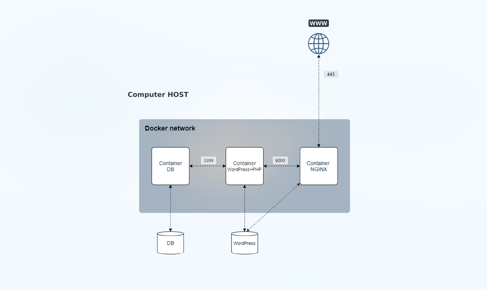

# Dockerized Infrastructure: Nginx, MariaDB, WordPress



This project sets up a containerized infrastructure using Docker, consisting of Nginx, MariaDB, and WordPress. The containers are orchestrated using Docker Compose, and custom images are created for each service.

## Glossary

Before diving into the details, here are some key terms used in this project:

1. **Docker**: A platform for developing, shipping, and running applications in isolated environments called containers.

2. **Container**: A lightweight, standalone, executable package that includes everything needed to run a piece of software, including the code, runtime, system tools, libraries, and settings.

3. **Docker Compose**: A tool for defining and running multi-container Docker applications. With Compose, you use a YAML file to configure your application's services.

4. **Dockerfile**: A text document that contains all the commands a user could call on the command line to assemble an image. Using `docker build` users can create an automated build that executes several command-line instructions in succession.

5. **Image**: A lightweight, standalone, executable package that includes everything needed to run a software application.

6. **Makefile**: A file containing a set of directives used by a `make` build automation tool to generate a target/goal.

7. **NGINX**: An open-source web server that can also be used as a reverse proxy, load balancer, mail proxy, and HTTP cache.

8. **TLS (Transport Layer Security)**: A cryptographic protocol designed to provide communications security over a computer network. TLSv1.2 and TLSv1.3 are versions of this protocol.

9. **WordPress**: A free and open-source content management system (CMS) written in PHP and paired with a MySQL or MariaDB database.

10. **php-fpm (PHP FastCGI Process Manager)**: An alternative PHP FastCGI implementation with some additional features useful for sites of any size, especially busier sites.

11. **MariaDB**: A community-developed, commercially supported fork of the MySQL relational database management system (RDBMS), intended to remain free and open-source software.

12. **Volume**: In Docker, volumes are used to persist data generated by and used by Docker containers.

13. **Debian/Alpine (Linux distributions)**: Both are free and open-source operating systems based on the Linux kernel but they are designed for different use cases. Debian is known for its stability and vast package repository, while Alpine is known for its small size and security features, making it popular in Docker environments.

14. **Networks in Docker**: Networks provide isolation for containers, allowing them to communicate with each other and with the outside world.

15. **YAML (YAML Ain't Markup Language)**: A human-readable data serialization standard that can be used in conjunction with all programming languages and is often used to write configuration files.

#

## Table of Contents
- [Overview](#overview)
- [Project Structure](#project-structure)
- [Getting Started](#getting-started)
- [Configuration](#configuration)
- [Dockerfiles](#dockerfiles)
- [Environment Variables](#environment-variables)
- [Customization](#customization)
- [Networking](#networking)
- [Volumes](#volumes)
- [Contributing](#contributing)

## Overview
This Docker project aims to provide a scalable and easily deployable infrastructure for web applications. It includes the following components:

- **Nginx:** Web server with SSL support.
- **MariaDB:** Relational database management system.
- **WordPress:** Popular content management system.

## Project Structure
The project follows a structured organization for each service:
``` 
.
├── Makefile
└── srcs
    ├── docker-compose.yml
    └── requirements
        ├── mariadb
        │   ├── Dockerfile
        │   └── tools
        │       └── setup.sh
        ├── nginx
        │   ├── conf
        │   │   └── nginx.conf
        │   └── Dockerfile
        └── wordpress
            ├── conf
            │   └── wp-entrypoint.sh
            └── Dockerfile
```

- `requirements`: Contains individual directories for each service, housing Dockerfiles and additional configuration files.
- `docker-compose.yml`: Defines the services, networks, and volumes, and orchestrates the containers.

## Getting Started
To deploy the Dockerized infrastructure, follow these steps:

1. Clone the repository: `git clone https://github.com/Labrahmi/Inception-42`
2. Navigate to the project directory: `cd Inception-42`
3. Build and start the containers: `docker-compose up -d`
4. Access services via the defined ports (e.g., Nginx on port 443).

## Configuration
The project uses environment variables defined in the `.env` file for configuring services. Customize the variables according to your requirements.

## Dockerfiles
- **Nginx (`requirements/nginx/Dockerfile`):**
  - Installs Nginx and OpenSSL, configures SSL, and sets up a custom Nginx configuration.

- **MariaDB (`requirements/mariadb/Dockerfile`):**
  - Installs MariaDB, sets up necessary directories, and executes an initialization script (`tools/setup.sh`).

- **WordPress (`requirements/wordpress/Dockerfile`):**
  - Installs required dependencies, sets up PHP and WordPress CLI, and configures the WordPress installation.

## Environment Variables
The `.env` file contains variables for configuring the database, user credentials, and other settings.

```dotenv
# Database

DB_NAME=value
USER_NAME=value
USER_PASSWORD=value
ADMIN_PASSWORD=value
#
EMAIL=value
EMAIL_ADMIN=value
```

## Customization
Feel free to customize the Dockerfiles, configuration files, and scripts based on your specific requirements. Document any changes made for future reference.

## Networking
The project uses a custom Docker network (`docker_network`) to isolate services and facilitate communication. Ensure that services can reach each other using their service names.

## Volumes
Bind mounts are used for volumes, ensuring data persistence between container restarts. Customize the volume paths in `docker-compose.yml` according to your host system.

## Contributing
Feel free to contribute by opening issues or pull requests. Your feedback and contributions are welcome!
